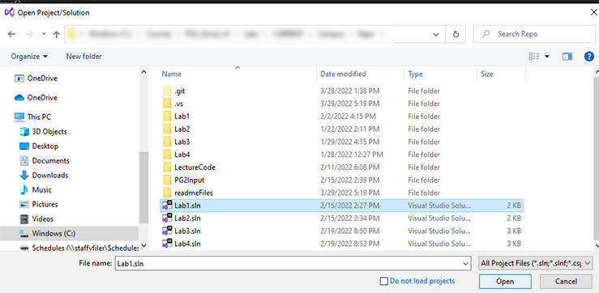

# PG2 Labs
This is your repo for the labs in PG2 (COP2334). Each lab has its own SLN file and folder. The lab structure (solutions and projects) has been provided for you. 
<ins>Do not create your own projects</ins> -- use the ones we provide.  There is also a folder called LectureCode. Use the LectureCode directory to put your projects that you 
create during the lectures. 

**All code is to be written in C# using the Visual Studio IDE. Use the latest version of the IDE that Full Sail provides to you.**

<!--TOC-->
  - [Working with GitHub](#working-with-github)
    - [Videos](#videos)
    - [Tips](#tips)
  - [How to Work on a Lab](#how-to-work-on-a-lab)
    - [1. Open from Windows Explorer](#1.-open-from-windows-explorer)
    - [2. Open in Visual Studio](#2.-open-in-visual-studio)
  - [Help! I can't find my repo!](#help-i-cant-find-my-repo)
  - [Where is the Lab document?](#where-is-the-lab-document)
<!--/TOC-->

## Working with GitHub
### Videos
GitHub is most likely new to you. Here are some videos for working with GitHub.
[GitHub How-to videos](https://web.microsoftstream.com/channel/14a0f6f0-cdcf-4e78-8cf6-457ce75462cb)
### Tips
* Don't move the repo once you've cloned it.
* There's no need to clone the repo multiple times. If you're having a problem with GitHub, reach out to an instructor for help.
* Commit + Push often. [How-to Commit + Push](https://web.microsoftstream.com/video/06e01a83-b492-44da-92c3-fea4e3864665)

## How to Work on a Lab
After cloning the repo to your local computer, it's time to start working on the labs for PG2.
We have provided the basic project structure that you'll need. To get started on a specific lab, you load the labs sln file in the root of the repo.

EX: to work on lab 1, open the Lab1.sln file in Visual Studio.
There are <ins>**2 ways to open**</ins> the solution:
### 1. Open from Windows Explorer
Navigate to the repo on your local machine. Double-click the sln file. 

### 2. Open in Visual Studio
From Visual Studio, choose File->Open->Project/Solution. Navigate to the location of the repo and select the sln file. 

## Help! I can't find my repo!
If you can't remember where you cloned the repo on your local computer, the most likely place you'll find it is where Visual Studio 
defaults for new projects:  **c:\Users\\\<your Windows user name>\source\repos** . Look for a folder that has **PG2**, the **year+month** (EX: 2203 for March 2022), and 
your **GitHub user name** in the name of the folder. 

## Where is the Lab document?
Each lab has a folder. There is a **pdf** file in those folders specific to the lab. 

